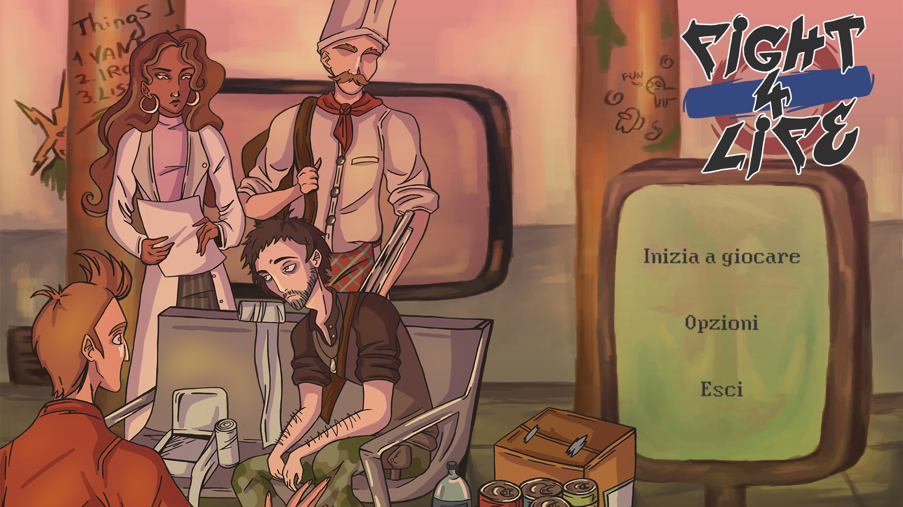
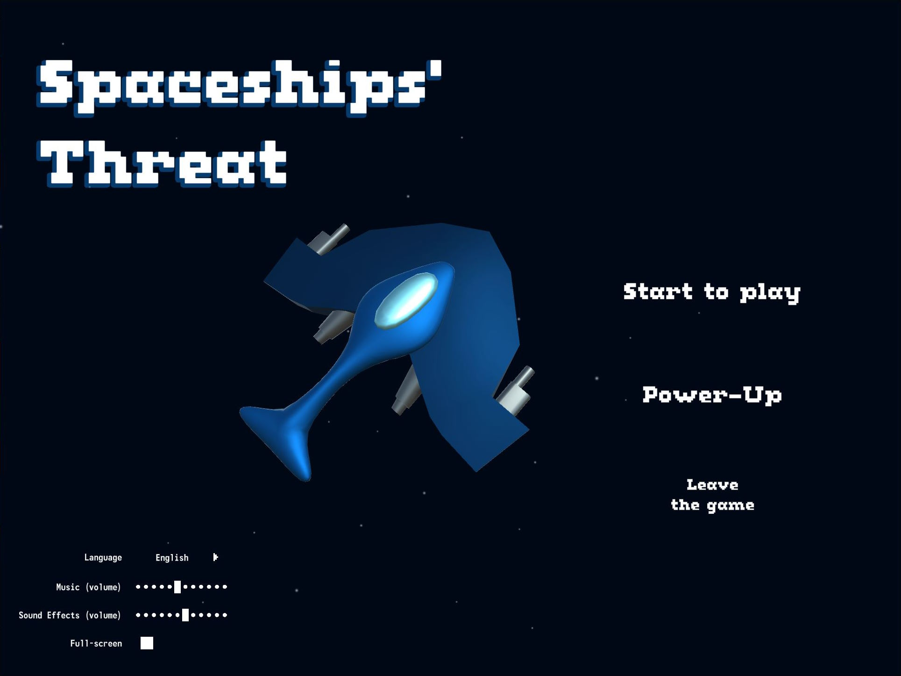
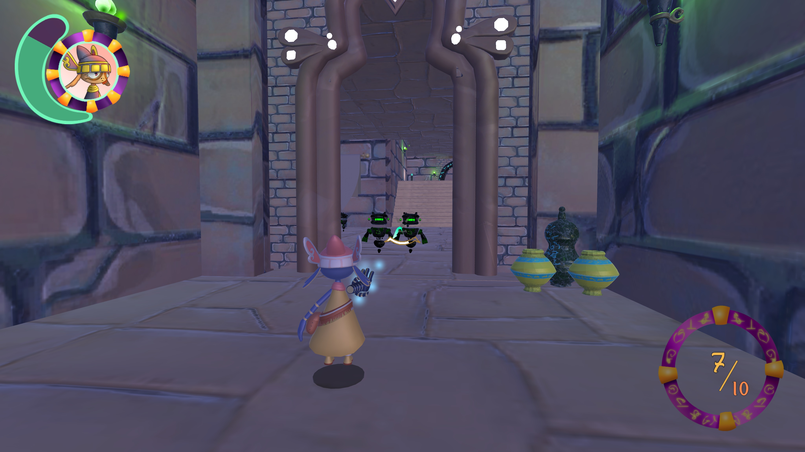
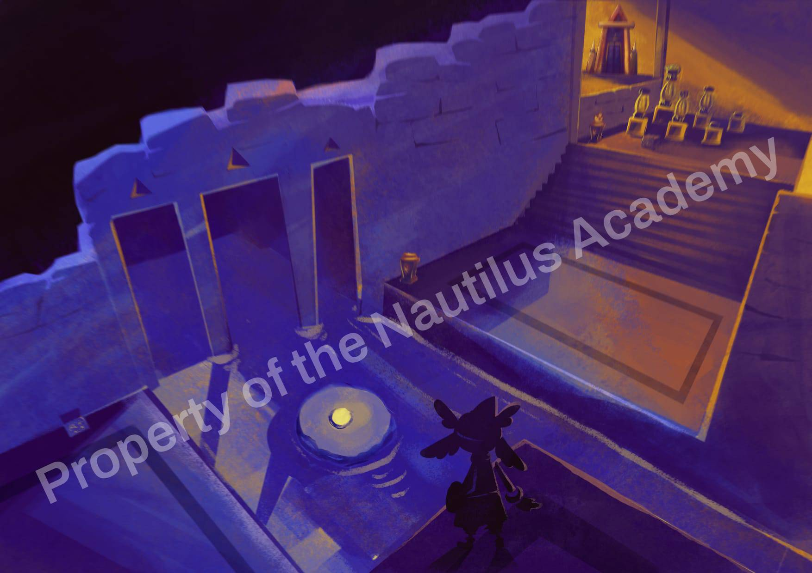

<link href="./other/styles.css" rel="stylesheet">

<right-text><a href="./ita_index">[ Versione Italiana qui ]</a></right-text>

 

<wip-panel>[ &#9888; WIP ]</wip-panel>

# About me 
Hi, I'm Francesco, I'm a junior italian programmer looking for a job in the (video)game industry.

I've studied Game Development and Game design at the Nautilus Academy, now I'm developing _[Going to Sleep](#going-to-sleep)_, a small game about counting sheep before sleeping.

<!-- Game Development and Game design, which  game development and game design -->

More in-depth page: [[About me]](./about "Go to the &quot;About me&quot; page &rarr;")

My Resume/CV: [[here]](./assets/pdf/francesco_degno_resume.pdf "Click to download my Resume / CV")

### &ensp; Programming Skills

| Level          | Languages | Engines       |
|----------------|-----------|---------------|
| `Intermediate` | C#        | Unity         |
| `Beginner`     | C++       | Unreal Engine |

 

# Projects

### &emsp; Fight 4 Life

| Roles           |
|-----------------|
| Main programmer |
| Game Designer   |

_Fight 4 Life_ is a 2D survival indie game where the Sun is a deadly laser and 4 characters find themselves in a subway, trying to find safety from the heat. The player's job is to keep them alive, rationing all the resources, explore the outside of a station at night and fight if necessary.

**_Feature(s)_**

- A sliding minigame &ndash; the Minig-aim
    - Used in a fight to defend against bad guys
    - Every weapon type determines the style of sliding
- All stations have different types of resources
- Adaptive music
    - Changes if a character is out exploring or not
    - Becomes more tense in fights
- 2 languages (Italian & English)
- 2 endings

* * *

### &emsp; Spaceships' Threat

| Roles           |
|-----------------|
| Main programmer |
| Game Designer   |
| Main Artist     |

_Spaceships' Threat_ is a small arcade 3D videogame that is based on fast action and replayability. You are the villain, who wants to conquer the universe by defeating all spaceships of the  "good guys", collects their Scraps and use them to upgrade their ship, to conquer better and stronger! 

**_Feature(s)_**

- A self-made saving system (saves the current currency and options)
- Power-ups that can be applied to the ship
- Replayability: defeat "the good guys" to earn more Scraps (currency) and upgrade your ship to become better at defeating them

* * *

### &emsp; Going to Sleep

<!-- [ ]: G2S screen -->
<!-- ~~~~ -->

A small game under development about counting sheep before sleeping, inspired by the act of sheep counting and the cartoon representation.

**_Feature(s)_**

- A sliding minigame with a cute sheep which will make the character fall asleep

* * *

## Academy work

&emsp; &emsp; (Nautilus Academy Copyright)

### &ensp; _GlyphSeeker_

<!-- FIXME: GlS screen -->
<!--~~~~-->

(Left: game screenshot; Right: concept art of the game)

| Roles         |
|---------------|
| Programmer    |
| Game Designer |

_GlyphSeeker_ is a 3D first person action game where the main character has 4 types of runes, each one has a different type of shooting ability (specifically: _Electric_, _Explosive_, _Shield_ and _Dematerializer_). She will use those abilitis to solve puzzles and make her way out from all enemies.

&ensp; &ensp; (This game is a work made with other people while I was studying in the Academy)

**_Feature(s)_**

- 4 different types of shooting abilities (runes)
    - I worked mainly on the blue one, the Shield, and offered to help on the purple one, the Dematerializer
- A complex saving system (it was self-made, included with encryption), but not implemented due to the little time the team had
    - [[Here]](https://github.com/NautilusAcademy/GlyphSeeker/blob/Salvataggio_e_Opzioni/Proj_GlyphSeeker/Assets/Script/-Saves%20%2B%20Options/SaveManager.cs) is the code

### _Other projects I've worked on_

- _Global Game Jam 2024_
    - Role(s): programmer
    - [[Game link]](https://globalgamejam.org/games/2024/clowning-around-9 "Clowning Around")
- _Global Game Jam 2023_
    - Role(s): main programmer, game designer
    - [[Game link]](https://v3.globalgamejam.org/2023/games/lost-seed-4 "The Lost Seed")

 

### Contacts

> E-mail: [franc.degno@gmail.com](mailto:franc.degno@gmail.com "Click to email me!")

> [[ Resume/CV ]](./assets/pdf/francesco_degno_resume.pdf "Click to download my Resume / CV")