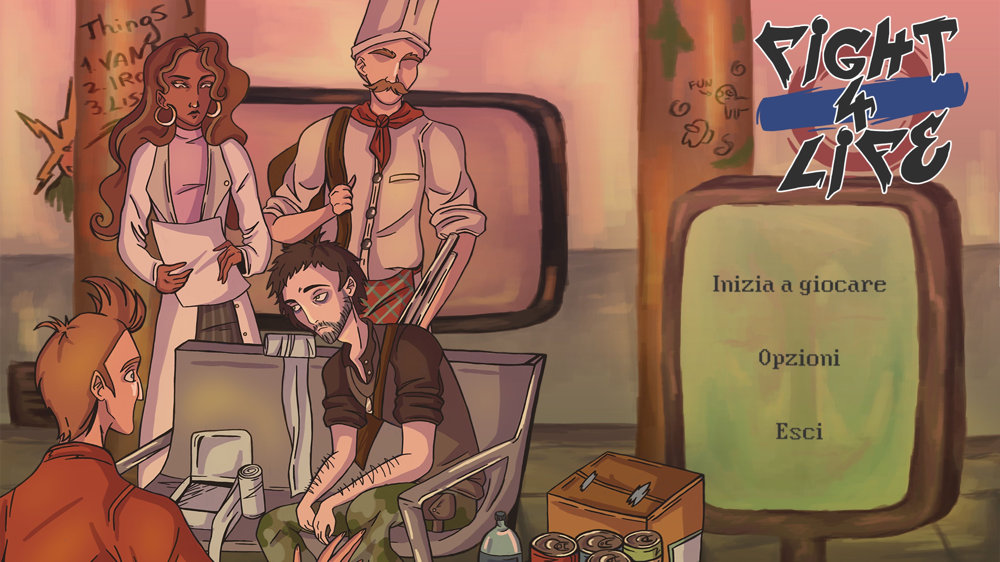
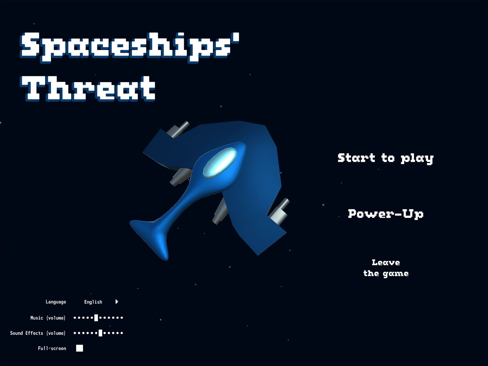
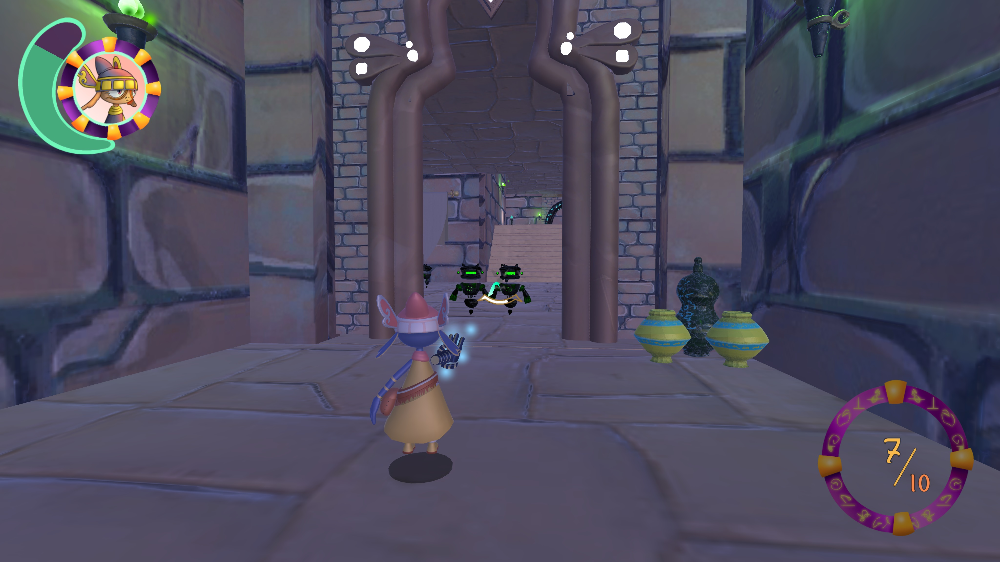
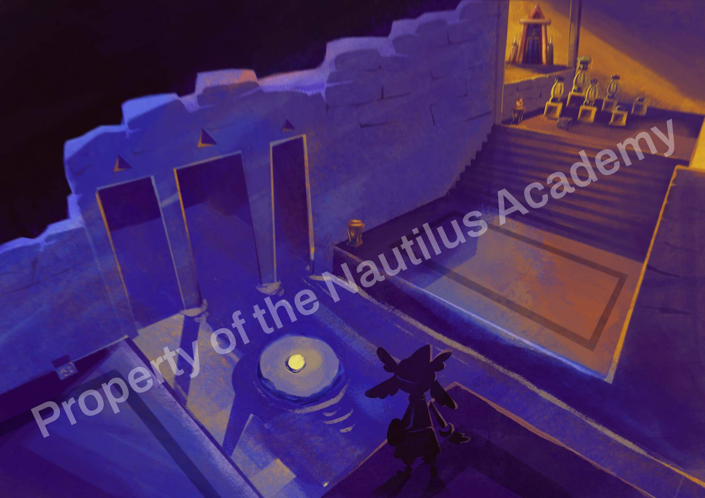

<link href="./other/styles.css" rel="stylesheet">

<right-text><a href="./ita_index">[ Versione Italiana qui ]</a></right-text>

  

<!-- <wip-panel>[ &#9888; WIP ]</wip-panel> -->

# About me 
Hi, I'm Francesco, I'm a junior italian programmer looking for a job in the (video)game industry.

I've studied Game Development and Game design at the Nautilus Academy, now I'm developing _[Going to Sleep](#going-to-sleep)_, a small game about counting sheep before sleeping. [[Read more&hellip;]](./about "Open the &quot;About me&quot; page &rarr;")

<!-- Game Development and Game design, which  game development and game design -->

My Resume/CV: [[here]](./assets/pdf/francesco_degno_resume_s.pdf "Click to download my Resume / CV") – <i style="color: LightBlue">(full version on the bottom)</i>

### &ensp; Programming Skills

| Level          | Languages | Engines       |
|----------------|-----------|---------------|
| `Intermediate` | C#        | Unity         |
| `Beginner`     | C++       | Unreal Engine |
<!--| `Beginner`     | GDScript  | Godot         |-->

  

# Projects

### &emsp; Yamigatari:FOR3ST

    <iframe width="500" height="300" src="https://www.youtube.com/embed/gNR3R6dprqY" title="YAMIGATARI: FOR3ST — Official Trailer (2D Psychological Horror Game)" frameborder="0" allow="accelerometer; autoplay; clipboard-write; encrypted-media; gyroscope; picture-in-picture; web-share"  allowfullscreen style="margin: 0.5em;"></iframe>
    <iframe src="https://store.steampowered.com/widget/4025010/" title="The official Steam page of YAMIGATARI: FOR3ST" frameborder="0" width="646" height="190" style="scale: 1;"></iframe>
    <!-- OG video: width="914" height="533" / OG Steam: width="646" height="190" -->

| Role                      |
|---------------------------|
| Main (Italian) Translator |

`(Steam description)` _Yamigatari:FOR3ST_ is a 2D psychological horror game that tells the chilling story of a young girl trapped in a nightmare she cannot escape. What began as a peaceful retreat into nature quickly transforms into a desperate fight for survival when Nora discovers an entity stalking her through the trees. 

**Note:** The director asked (on his Discord server) if there were any people who could help translating the game in another language, and I offered to help translating it into Italian.

* * *

### &emsp; Fight 4 Life

| Roles           |
|-----------------|
| Main programmer |
| Game Designer   |

_Fight 4 Life_ is a 2D survival indie game where the Sun is a deadly laser and 4 characters find themselves in a subway, trying to find safety from the heat. The player's job is to keep them alive, rationing all the resources, explore the outside of a station at night and fight if necessary.

What started as a simple game written in `C` for the command console, it began as a game idea that spiraled in this little game/side project made with a friend of mine!

**_Challenge(s)_**

- _Fight 4 Life_ is a game made in 3 months, with a friend (I handled the coding part, my friend the visual aspect, and we both managed the game design & balancing)
    - we tried managing the time by having the Game Design Document done by the end of the first 2 weeks, the most important mechanics and assets done by the half of the 2nd month, while adding and refining them towards the 3rd month
- The game features the "Minig-aim", a minigame with a sliding bar, where you have to hit the bar as close to the center as possible, but the movement and the speed of the bar itself depends on which weapon you found
    - At first, it felt really fun but lacked rewards, so we decided that it gives more resources on how close to the center you center

<!--**_Feature(s)_**

- A sliding minigame &ndash; the Minig-aim
    - Used in fights to defend against bad guys
    - Every weapon type determines the style of sliding
- Every station offers different types of resources
- Adaptive music
    - Changes if a character is out exploring or not
    - Becomes more tense in fights
- 2 languages (Italian & English)
- 2 endings-->

* * *

### &emsp; Spaceships' Threat

| Roles           |
|-----------------|
| Main programmer |
| Game Designer   |
| Main Artist     |

_Spaceships' Threat_ is a small arcade 3D videogame that is based on fast action and replayability. You are the villain, who wants to conquer the universe by defeating all spaceships of the  "good guys", collecting their Scraps and using them to upgrade the ship and conquer better and stronger! 

**_Challenge(s)_**

- _Spaceships' Threat_ has a simple but intricate save system, which saves important stuff (such as the current currency amount, unlocked power-ups and options) by first having these variables stored in a Scriptable Object (so accessible and editable anywhere in the game), and then writing all of that into a pc file
    - (I am really proud of how this save system came out)
- An important aspect of this game is the _replayability_: to achieve this feeling, I made the Scraps (the currency of this game) "persistent", meaning that they get added to the one already earned when getting a Game Over
    - By also adding the Power-ups, the replayability aspect grew even more, since I took inspiration from older arcade games + recent factory games (that lets you get better over time while getting more currency)

<!--**_Feature(s)_**

- A self-made saving system (saves the current currency amount and options)
- Power-ups that can be applied to the ship
- Replayability: defeat "the good guys" to earn more Scraps (currency) and upgrade your ship to become better at defeating them-->

* * *

### &emsp; Going to Sleep

<!-- [ ]: G2S screen -->
<!-- ~~~~ -->

A small game under development about counting sheep before sleeping, inspired by the act of sheep counting and the cartoon representation.

**_Challenge(s)_**

- A curved sliding minigame with a cute sheep, which will help the main character fall asleep
    - (the same concept as the one in _[Fight 4 Life](#fight-4-life)_)

* * *

## Academy work

&emsp; &emsp; (All protected under the Nautilus Academy Copyright)

### &ensp; _Quiet puzzles_

<!-- FIXME: QP screen -->
~~~~
<!--    -->
<!--    -->

<!--(Left: game screenshot; Right: concept art of the game)-->

| Roles         |
|---------------|
| Programmer    |
| Game Designer |
| Main Artist   |

_Quiet Puzzles_ is a demo of a 3D first person puzzle-platformer game that uses 3 main abilities. They are slowly unlocked throughout the demo and the player has to use them in a couple of puzzles.

&ensp; &ensp; (This game is a work made with the help of other people while I was studying in the Academy)

**_Challenge(s)_**

- 3 different types of abilities (the "Hand", the "Water Gun" and the "Bomb")
    - A wheel for the abilities I worked and developed, in which the abilites rotate as it uses the mouse wheel to cycle between them

### &ensp; _Walking the planks_

<!-- FIXME: WtP screen -->
~~~~
<!--    -->
<!--    -->

<!--(Left: game screenshot; Right: concept art of the game)-->

| Roles         |
|---------------|
| Programmer    |
| Game Designer |
| Main Artist   |

_Walking the planks_ is a demo of a 3D first person platformer game developed with the theme of pirates, where the main character has to traverse various type of traps and obstables. With that, the player also uses his trusted flintlock pistol <!--pistola a pietra focaia--> to help themself throughout the puzzles and the whole game.

&ensp; &ensp; (This game is a work made with the help of other people while I was studying in the Academy)

**_Challenges(s)_**

- An always fully loaded gun that can destroy targets and activate some switches
- A rolling barrel inspired by cartoons that can be ridden 
    - When ridden, the player needs to go backwards to make the barrel roll forward, and vice-versa (it follows how physics should work)
    > (Made using the Dot product between the direction where the player is looking and the "forward" direction of the barrel – limiting the movement of the player to move only sideways, and not forward or backwards, when on top of the barrel)
- Two different types of switches: a toggle one (that switches depending on which side is left on) and a pushable one (that needs to remain pushed to stay active)
    - Both of them are physics based (so the player or objects, like boxes, can interact with them)
- A Rum-based mechanic that shows some hidden platforms over a specific period of time when drank

### &ensp; _GlyphSeeker_

<!-- FIXME: GlS screen -->
<!--~~~~-->

(Left: game screenshot; Right: concept art of the game)

| Roles         |
|---------------|
| Programmer    |
| Game Designer |

_GlyphSeeker_ is a 3D first person action game where the main character has 4 types of runes, each one has a different type of shooting ability (specifically: _Electric_, _Explosive_, _Shield_ and _Dematerializer_). She will use those abilitis to solve puzzles and make her way out from all enemies.

&ensp; &ensp; (This game is a work made with other people while I was studying in the Academy)

**_Challenge(s)_**

- 4 different types of shooting abilities (runes)
    - I worked mainly on the blue one, the Shield, and offered to help on the purple one, the Dematerializer
- A complex saving system (it was self-made, included with encryption), but not implemented due to the little time the team had
    - [[Here]](https://github.com/NautilusAcademy/GlyphSeeker/blob/Salvataggio_e_Opzioni/Proj_GlyphSeeker/Assets/Script/-Saves%20%2B%20Options/SaveManager.cs) is the code

### _Other smaller projects I've worked on_

- _Global Game Jam 2026_
    - Role(s): programmer, game designer
    - [[Game link]](https://globalgamejam.org/games/2026/identity-seeker-9 "Identity-Seeker")
- _Global Game Jam 2024_
    - Role(s): programmer
    - [[Game link]](https://globalgamejam.org/games/2024/clowning-around-9 "Clowning Around")
- _Global Game Jam 2023_
    - Role(s): main programmer, game designer
    - [[Game link]](https://v3.globalgamejam.org/2023/games/lost-seed-4 "The Lost Seed")

  

### Contacts

> E-mail: [franc.degno@gmail.com](mailto:franc.degno@gmail.com "Click to email me!")

> [[ Resume/CV ]](./assets/pdf/francesco_degno_resume.pdf "Click to download my Resume / CV") <i style="color: LightBlue">(full vers.)</i>