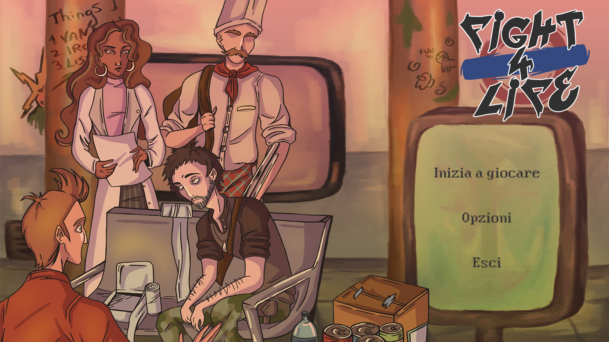
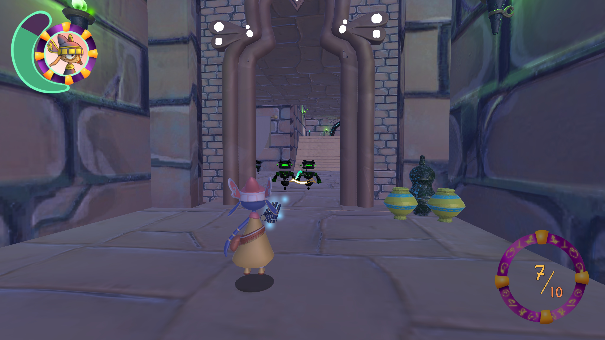

<link href="./other/styles.css" rel="stylesheet">

<right-text>[[ English versione here ]](./)</right-text>

 

# Chi sono
Ciao, sono Francesco, un programmatore junior che sta cercando un lavoro nell'industria dei (video)giochi.

Ho studiato Game Development & Game design alla Nautilus Academy, mentre ora sto lavorando a _[Going to Sleep](#going-to-sleep)_, un gioco [piccolo] basato sul contare le pecore prima di addormentarsi.

Pagina più estesa: [[Chi sono]](./ita_about "Vai alla pagina &quot;Chi sono&quot; &rarr;")

Il mio CV: [[qui]](./assets/pdf/francesco_degno_cv_ita.pdf "Clicca per scaricare il mio CV")

### &ensp; Conoscenze di programmazione

| Livello        | Lingue | Game Engine   |
|----------------|--------|---------------|
| `Intermedio`   | C#     | Unity         |
| `Principiante` | C++    | Unreal Engine |

 

# Progetti

### &emsp; Fight 4 Life

| Ruoli                    |
|--------------------------|
| Programmatore principale |
| Game Designer            |

_Fight 4 Life_ è un gioco survival indie in 2D dove la temperatura del sole è oltre le stelle e 4 personaggi si trovano intrappolati dentro una stazione della metro, mentre provano a trovare riparo dal calore. Il compito del giocatore è quello di tenerli in vita, dividere le risorse, esplorare nottetempo l'esterno di una stazione e lottare qualora fosse necessario.

**_Feature_**

- Un minigame con una barra a scorrimento &ndash; il Mira-game
    - Usato nelle lotte per difenderti contro i brutti ceffi
    - Ogni arma determina lo stile di movimento della barra
- In ogni stazione si trovano un tipo diverso di risorse
- Musica dinamica
    - Cambia se c'è un personaggio in esplorazione o no
    - Diventa più intensa nelle lotte
- 2 lingue (italiano & inglese)
- 2 finali

* * *

### &emsp; Spaceships' Threat

| Ruoli                    |
|--------------------------|
| Programmatore principale |
| Game Designer            |
| Artista principale       |

_Spaceships' Threat_ è un piccolo gioco arcade in 3D che si basa su azioni rapide e rigiocabilità. Giochi nei panni del cattivo, il quale vuole conquistare l'universo a tutti i costi distruggendo tutte le astronavi dei "buoni", raccogliere i loro Rottami e usarli per migliorare la sua astronave, per conquistare meglio l'intero universo!

**_Feature_**

- Un sistema di salvataggio realizzato da sé (in cui salva la quantità di valuta corrente e le opzioni)
- Miglioramenti (Power-up) che vengono applicati all'astronave
- Rigiocabilità: sconfiggi "i buoni" per guadagnare più Rottami (la valuta) e potenzia la tua astronave per poterli sconfiggere meglio

* * *

### &emsp; Going to Sleep

<!-- ~~~~ -->

Un piccolo gioco in sviluppo che si basa sul contare le pecore prima di addormentarsi, ispirato dall'atto del contare le pecore e dalla sua rappresentazione nei cartoni animati.

**_Feature_**

- Un minigame con una barra scorrevole che ha una piccola pecora che aiuterà ad addormentare il personaggio principale

## Lavoro in accademia

&emsp; &emsp; (Nautilus Academy Copyright)

### &ensp; _GlyphSeeker_

(Sinistra: screenshot del gioco; Destra: concept art del gioco)

| Ruoli         |
|---------------|
| Programmatore |
| Game Designer |

_GlyphSeeker_ è un gioco in 3D in prima persona dove il personaggio principale ha 4 tipi diversi di rune, ognuna con la sua abilità di tiro (in particolare: _Elettrica_, _Esplosiva_, _Scudo_ e _Smaterializzatore_). Lei dovrà usare le suddette rune per risolvere puzzle e farsi strada tra tutti i nemici che incontrerà.

&ensp; &ensp; (Questo gioco è stato realizzato con altre persone quando studiavo all'accademia)

**_Feature_**

- 4 tipi diversi di abilità di tiro (le rune)
    - Io ho lavorato principalmente sulla runa blu, lo Scudo, e mi sono offerto nel lavorare anche su quella viola, lo Smaterializzatore
- Un sistema di salvataggio complesso (è realizzato da sé, con crittografia inclusa), ma non implementato dato il poco tempo a disposizione
    - Il codice lo si può trovare [[Qui]](https://github.com/NautilusAcademy/GlyphSeeker/blob/Salvataggio_e_Opzioni/Proj_GlyphSeeker/Assets/Script/-Saves%20%2B%20Options/SaveManager.cs)

* * *

### &ensp; _Global Game Jam 2024_

- _Global Game Jam 2024_
    - Ruolo/i: programmatore
    - [[Link al gioco]](https://globalgamejam.org/games/2024/clowning-around-9 "Clowning Around")
- _Global Game Jam 2023_
    - Ruolo/i: programmatore principale, game designer
    - [[Link al gioco]](https://v3.globalgamejam.org/2023/games/lost-seed-4 "The Lost Seed")

 

### Contatti

> E-mail: [franc.degno@gmail.com](mailto:franc.degno@gmail.com "Clicca per mandarmi un'email!")

> [[ Curriculum / CV ]](./assets/pdf/francesco_degno_cv_ita.pdf "Clicca per scaricare il mio Curriculum (CV)")
